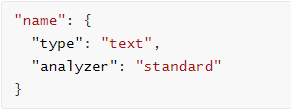
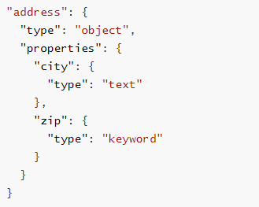

## 基础操作介绍

​	索引相当于数据库，创建索引就是创建一些数据库。

​	然后给对应的索引设置映射，映射就相当于是给索引设置一些规则(文档字段的存储方式、查询方式和分析方式)，就像是设置数据库的字符集、是否开启慢sql监控等。

​	之后给索引上传文档，也就是我们需要解析的文档，上传文档后，文档会根据索引设置的各种规则(分词规则、映射信息)生成倒排索引，便于查询。

​	也就是说，可以把 **Elasticsearch 索引** 看作是一个 **数据库**，每个索引有自己的 **映射（Mapping）**、**分词规则（Analyzer）**、**设置（Settings）** 等信息。而上传文档到指定索引时，就相当于按照该索引的规则来存储数据，生成倒排索引，并在查询时依赖于这些规则来执行搜索。

**创建索引或上传文档时指定的索引 和 上传文档后生成的倒排索引的区别：**

1. **上传文档到指定的索引**：

   - 这个“指定的索引”是你在上传文档时提供的索引名称，它决定了文档在哪个逻辑容器中存储。索引本质上是 Elasticsearch 存储文档和元数据（如倒排索引）的容器。

   例如，如果你上传文档到 `products` 索引，那么 Elasticsearch 会根据该索引的映射（Mapping）和设置（Settings）来存储文档，并在内部生成倒排索引。

2. **倒排索引**：

   - 对于每个被上传的文档，Elasticsearch 会对其内容（尤其是文本字段）进行解析，生成倒排索引。倒排索引的生成是基于文档中各个字段的内容（如文本分词后形成的词项）。这些倒排索引是存储在指定索引内的。

即：

- **上传文档指定索引**：指定文档应该属于哪个索引，这个索引为文档提供了映射规则、分析器等配置。
- **生成倒排索引**：文档上传后，文档字段会根据映射规则和分析器生成倒排索引，倒排索引是用来加速搜索的。

## HTTP 操作

​	注意，ES默认启动后，9200端口为对外服务接口。

### 1、索引操作

#### **1)** **创建索引** 

​	对比关系型数据库，创建索引就等同于创建数据库。

​	也可以创建索引时就指定映射等规则，这里采用默认规则。

请求类型：PUT

请求地址：/{索引名称}  # 注意，索引名称不能存在大写单词，可以用"_"来间隔

请求体：

​	请求时可以不携带请求体，则采用默认配置。

其中，各个参数具体介绍：

**settings**：设置索引的一些基本属性，比如分片数、复制数等。

- `number_of_shards`: 定义索引的分片数量。
- `number_of_replicas`: 定义索引的副本数量。

**mappings**：定义索引中字段的属性。

- **properties**：定义具体字段的属性，如字段的类型、分析器等。
- 每个字段可以有不同的类型和设置。例如，`text` 字段适用于需要分词的文本数据，而 `keyword` 字段适用于不进行分词的精确匹配。

~~~ json
{
  "settings": {
    "number_of_shards": 3,  // 分片数量
    "number_of_replicas": 2  // 副本数量
  },
  "mappings": {
    "properties": {
      "name": {
        "type": "text",  // 文本字段，会进行分词
        "analyzer": "standard"  // 使用标准分词器
      },
      "price": {
        "type": "float",  // 数值字段，表示浮动数值
        "index": true  // 该字段会被索引
      },
      "created_at": {
        "type": "date",  // 日期字段
        "format": "yyyy-MM-dd HH:mm:ss"  // 日期格式
      },
      "category": {
        "type": "keyword",  // 精确匹配字段，不会分词
        "index": true  // 该字段会被索引
      }
    }
  }
}
~~~


响应体：

```json
{
	"acknowledged": true, # 响应结果 true表示操作成功
	"shards_acknowledged": true, # 分片结果 true表示操作成功
	"index": "shopping" # 索引名称
}
```

例如：

​	在 Postman 中，向 ES 服务器发 **PUT** 请求 ：http://127.0.0.1:9200/shopping

响应体：

```json
{
	"acknowledged": true,
	"shards_acknowledged": true,
	"index": "shopping"
}
```

​	再次创建索引shopping，就会创建失败，因为已经存在。

```json
{
	"error": {
		"root_cause": [
			{
				"type": "resource_already_exists_exception",
				"reason": "index [shopping/WP8DXtUgQHqZOnmDkqxHsQ] already exists",
				"index_uuid": "WP8DXtUgQHqZOnmDkqxHsQ",
				"index": "shopping"
			}
		],
		"type": "resource_already_exists_exception",
		"reason": "index [shopping/WP8DXtUgQHqZOnmDkqxHsQ] already exists",
		"index_uuid": "WP8DXtUgQHqZOnmDkqxHsQ",
		"index": "shopping"
	},
	"status": 400
}
```

#### **2)** **查看所有索引**

请求类型：GET

请求地址：/_cat/indices?v 

响应体：

```json
health status index    uuid                   pri rep docs.count docs.deleted store.size pri.store.size
yellow open   shopping WP8DXtUgQHqZOnmDkqxHsQ   1   1          0            0       208b           208b
```

| 表头           | 含义                                                         |
| -------------- | ------------------------------------------------------------ |
| health         | 当前服务器健康状态： <br />  **green**(集群完整) <br />  **yellow**(单点正常、集群不完整) <br />  **red**(单点不正常) |
| status         | 索引打开、关闭状态                                           |
| index          | 索引名                                                       |
| uuid           | 索引统一编号                                                 |
| pri            | 主分片数量                                                   |
| rep            | 副本数量                                                     |
| docs.count     | 可用文档数量                                                 |
| docs.deleted   | 文档删除状态（逻辑删除）                                     |
| store.size     | 主分片和副分片整体占空间大小                                 |
| pri.store.size | 主分片占空间大小                                             |

例如：

​	在 Postman 中，向 ES 服务器发 **GET** 请求 ：http://127.0.0.1:9200/_cat/indices?v

响应体：


#### **3)** **查看单个索引**

请求类型：GET

请求地址：/{索引名称}

响应体：

```json
{
	"shopping": { # 索引名
		"aliases": {}, # 别名
		"mappings": {}, # 映射
		"settings": { # 配置
			"index": { # 配置-索引
				"creation_date": "1739341093610", # 创建时间
				"number_of_shards": "1", # 主分片数量
				"number_of_replicas": "1", # 副分片数量
				"uuid": "WP8DXtUgQHqZOnmDkqxHsQ", # 唯一标识
				"version": { # 版本
					"created": "7080099"
				},
				"provided_name": "shopping" # 名称
			}
		}
	}
}
```

#### **4)** **删除索引**

请求类型：DELETE

请求地址：/{索引名称}

响应体：

```json
{
	"acknowledged": true # 删除成功
}
```

索引不存在，删除失败示例：

```json
{
	"error": {
		"root_cause": [
			{
				"type": "index_not_found_exception",
				"reason": "no such index [test]",
				"resource.type": "index_or_alias",
				"resource.id": "test",
				"index_uuid": "_na_",
				"index": "test"
			}
		],
		"type": "index_not_found_exception",
		"reason": "no such index [test]",
		"resource.type": "index_or_alias",
		"resource.id": "test",
		"index_uuid": "_na_",
		"index": "test"
	},
	"status": 404
}
```

### 2、文档操作

#### **1)** **创建文档** 

​	索引已经创建好了，接下来我们来创建文档，并添加数据。

​	这里的文档可以类比为关系型数据库中的表数据，添加的数据格式为 JSON 格式 。

请求类型：POST

请求地址：

​	由ES生成文档id：/{索引名称}/_doc 	

​		即： 索引名称 + _doc

​	自定义文档id：/{索引名称}/_doc/{id} 	

​		即：索引名称 + _doc + 自定义id。若id已存在，则更新对应文档。

请求体：

​	请求体必须为JSON格式的内容。

响应体：

```json
{
	"_index": "shopping", # 索引名称
	"_type": "_doc", # 类型，doc:文档类型
	"_id": "L4qP-ZQBREgr-UZp08bI", # 类似于主键
	"_version": 1, # 版本
	"result": "created", # 结果，created表示创建成功
	"_shards": { # 分片
		"total": 2, # 分片总数
		"successful": 1,  # 分片成功数
		"failed": 0 # 分片失败数
	},
	"_seq_no": 0,
	"_primary_term": 1
}
```

例如：

​	在 Postman 中，向 ES 服务器发 **POST** 请求 ：http://127.0.0.1:9200/shopping/_doc

请求体

```json
{
 "title":"测试",
 "category":"123",
 "test":"test"
}
```

响应体

```json
{
	"_index": "shopping", # 索引名称
	"_type": "_doc", # 类型，doc:文档类型
	"_id": "L4qP-ZQBREgr-UZp08bI", # 类似于主键
	"_version": 1, # 版本
	"result": "created", # 结果，created表示创建成功
	"_shards": { # 分片
		"total": 2, # 分片总数
		"successful": 1,  # 分片成功数
		"failed": 0 # 分片失败数
	},
	"_seq_no": 0,
	"_primary_term": 1
}
```

#### **2)** **查看文档** 

​	查看文档时，需要指明文档的唯一性标识，类似于 MySQL 中数据的主键查询

请求类型：GET

请求地址：

​	/{索引名称}/_doc/{id} 	

​	即：索引名称 + _doc + 文档id。

响应体：

```json
{
	"_index": "shopping", # 索引名称
	"_type": "_doc", # 类型，doc标识文档类型
	"_id": "01", # 唯一标识
	"_version": 1, # 版本
	"_seq_no": 1, # 用于并发控制和版本管理，通常在执行并发更新时使用。
	"_primary_term": 1, # 用于并发控制和版本管理，通常在执行并发更新时使用。
	"found": true,# 查询结果，true标识查询到了
	"_source": { # 文档源信息
		"title": "测试",
		"category": "123",
		"test": "test"
	}
}
```

#### **3)** **修改文档** 

​	和新增文档一样，输入相同的 URL 地址请求，如果请求体变化，会将原有的数据内容覆盖 

请求类型：POST

请求地址：

​	/{索引名称}/_doc/{id} 	

​	即：索引名称 + _doc + 自定义id。

请求体：

​	必须为json格式，例如：

```json
{
    "title": "测试",
    "category": "123",
    "test": "test",
    "desc":"添加属性测试"
}
```

响应体

```json
{
	"_index": "shopping",
	"_type": "_doc",
	"_id": "01",
	"_version": 2, # 更新后版本号+1
	"result": "updated",# 处理结果，update标识数据被更新
	"_shards": {
		"total": 2,
		"successful": 1,
		"failed": 0
	},
	"_seq_no": 2,
	"_primary_term": 1
}
```

#### **4)** **修改文档字段** 

​	修改数据时，也可以只修改某一给条数据的局部信息

请求类型：POST

请求地址：

​	/{索引名称}/_update/{id} 	

​	即：索引名称 + _update + 自定义id。

请求体：

​	必须为json格式，针对上述修改文档中的属性进行修改

​	注意点1：必须使用 `doc` 包装你要更新的字段`doc` 是用来指定更新文档的部分内容的，它告诉 Elasticsearch **只更新文档的一部分字段**，而不是整个文档。

​	注意点2：如果文档中不存在某个字段，`_update` 操作会 **创建该字段**。

```json
{
    "title": "测试",
    "category": "123",
    "test": "test",
    "desc":"添加属性测试"
}
-----修改其中的desc属性-------
{
    "doc": {
        "desc": "修改字段测试"
    }
}
```

响应体

```json
{
	"_index": "shopping",
	"_type": "_doc",
	"_id": "01",
	"_version": 3,
	"result": "updated",
	"_shards": {
		"total": 2,
		"successful": 1,
		"failed": 0
	},
	"_seq_no": 3,
	"_primary_term": 1
}
```

#### **5)** **删除文档** 

​	删除一个文档不会立即从磁盘上移除，它只是被标记成已删除（逻辑删除）。

​	之后查询将查询不到。

请求类型：DELETE

请求地址：

​	/{索引名称}/_doc/{id} 	

​	即： 索引名称 + _doc + 自定义id。

响应体：

```json
{
	"_index": "shopping",
	"_type": "_doc",
	"_id": "01",
	"_version": 5, # 版本更新
	"result": "deleted", # 结果deleted表示被标记为逻辑删除
	"_shards": {
		"total": 2,
		"successful": 1,
		"failed": 0
	},
	"_seq_no": 5,
	"_primary_term": 1
}
```

#### **6)** **条件删除文档** 

​	一般删除数据都是根据文档的唯一性标识进行删除，实际操作时，也可以根据条件对多条数据进行删除 。

首先分别增加多条数据:

```json
{
 "title":"测试",
 "category":"123",
 "test":"test"
}
---------------------------
{
 "title":"测试2",
 "category":"123",
 "test":"test"
}
```

请求类型：POST

请求地址：

​	/{索引名称}/_delete_by_query

​	即：索引名称 + _doc + _delete_by_query。

请求体内容：

​	json格式

```json
{
    "query": {
        "match": {
            "title": "测试2"
        }
    }
}
```

响应体：

```json
{
	"took": 256,# 耗时
	"timed_out": false,# 是否超时
	"total": 3,# 总数
	"deleted": 3,# 删除数量
	"batches": 1,
	"version_conflicts": 0,
	"noops": 0,
	"retries": {
		"bulk": 0,
		"search": 0
	},
	"throttled_millis": 0,
	"requests_per_second": -1,
	"throttled_until_millis": 0,
	"failures": []
}
```

### 3、映射操作

​	有了索引库，等于有了数据库中的 database。

​	接下来就需要建索引库(index)中的映射了，类似于数据库(database)中的表结构(table)。 

​	创建数据库表需要设置字段名称，类型，长度，约束等；

​	索引库也一样，需要知道这个类型下有哪些字段，每个字段有哪些约束信息，这就叫做映射(mapping)。

#### **1)** 创建映射

​	对比关系型数据库，创建索引就等同于创建数据库。

请求类型：PUT

请求地址：/{索引名称}/_mapping 

​	即 索引名称 + _mapping

请求体：

```json
{
    "properties": {
        "name": {
            "type": "text", // 文本字段，会进行分词
            "analyzer": "standard" // 使用标准分词器
        },
        "price": {
            "type": "float", // 数值字段，表示浮动数值
            "index": true // 该字段会被索引
        },
        "created_at": {
            "type": "date", // 日期字段
            "format": "yyyy-MM-dd HH:mm:ss" // 日期格式
        },
        "category": {
            "type": "keyword", // 精确匹配字段，不会分词
            "index": true // 该字段会被索引
        }
    }
}
```

其中，各个参数具体介绍：

- **properties**：定义具体字段的属性，如字段的类型、分析器等。

- 每个字段可以有不同的类型和设置。例如，`text` 字段适用于需要分词的文本数据，而 `keyword` 字段适用于不进行分词的精确匹配。

  | 类型                     | 作用                                                       | 示例                                                |
  | ------------------------ | ---------------------------------------------------------- | --------------------------------------------------- |
  | **text**                 | 用于存储文本数据，会被分词。适用于全文搜索。               |  |
  | **keyword**              | 用于存储不进行分词的精确值，适用于过滤、排序、聚合等操作。 |  |
  | **date**                 | 用于存储日期类型数据，可以指定日期格式。                   |  |
  | **integer、float、long** | 用于存储数字数据。选择合适的类型来保证存储效率。           |  |
  | **boolean**              | 用于存储布尔类型的数据。                                   |  |
  | **object**               | 用于存储 JSON 对象，可以包含多个字段。                     |  |
  | **nested**               | 用于存储嵌套对象，以便执行嵌套查询。                       |  |

#### 2) 查看映射

请求类型：GET

请求地址：/{索引名称}/_mapping 

​	即 索引名称 + _mapping

响应体：

~~~ json
{
	"student": {
		"mappings": {
			"properties": {
				"category": {
					"type": "keyword"
				},
				"created_at": {
					"type": "date",
					"format": "yyyy-MM-dd HH:mm:ss"
				},
				"name": {
					"type": "text",
					"analyzer": "standard"
				},
				"price": {
					"type": "float"
				}
			}
		}
	}
}
~~~

#### 3) 索引映射关联

​	即创建索引时同时创建映射，1、索引操作->1）创建索引中有相关请求

### 4.查询

#### 1）查询所有文档

​	如上面介绍，文档都是上传到指定索引下，因此查询文档时，需要指定对应的索引。

请求类型：GET

请求地址：

​	/{索引名称}/_search	

​	即：索引名称 + _search	

响应体：

```json
{
	"took": 3,# 查询花费时间，单位毫秒
	"timed_out": false, # 是否超时
	"_shards": {# 分片信息
		"total": 1,# 总数
		"successful": 1,# 成功
		"skipped": 0,# 忽略
		"failed": 0# 失败
	},
	"hits": {# 搜索命中结果
		"total": {# 搜索条件匹配的文档总数
			"value": 2,# 总命中计数的值
			"relation": "eq"# eq表示计数准确，gte表示计数不准确
		},
		"max_score": 1,
		"hits": [# 命中结果集合
			{
				"_index": "shopping",
				"_type": "_doc",
				"_id": "02",
				"_score": 1,
				"_source": {
					"title": "谢谢谢谢",
					"category": "123",
					"test": "test"
				}
			},
			{
				"_index": "shopping",
				"_type": "_doc",
				"_id": "01",
				"_score": 1,
				"_source": {
					"title": "测试1",
					"category": "123",
					"test": "test"
				}
			}
		]
	}
}

```

#### 2）各种类型查询

​	match 匹配类型查询，会把查询条件进行分词，然后进行查询，多个词条之间是 or 的关系。

请求类型：GET

请求地址：

​	/{索引名称}/_search	

​	即：索引名称 + _search	

请求体：

​	这里get请求允许携带请求体，应该是ES的特殊操作，正常来说get请求不允许携带请求体。

```json
{
    "_source": ["title", "category"],
    "query": {
        "match": {
            "title": "谢谢谢谢"
        }
    },
    "from": 0,
    "size": 10
}

```

其中各个参数含义：

- query：查询部分，用于指定具体的查询条件。

- from 和 size：用于分页控制，`from` 指定从哪一条数据开始，`size` 指定返回的文档数量。

  - `from`: 查询结果的起始位置，默认是 0。
  - `size`: 返回的文档数量，默认是 10。

- _source：控制返回的字段，指定仅返回指定字段的内容。也可以通过下面两个属性来过滤字段。

  - includes：来指定想要显示的字段 
  - excludes：来指定不想要显示的字段

  

- sort：用于排序文档
  

- aggregations：用于对查询结果进行聚合（如统计、分组等）。这里aggregations可缩写为aggs.

  跟sql一样，聚合函数有很多，例如max、min、avg
  例如，计算 `price` 字段的平均值
  

- match：是一个查询类型，表示全文搜索，并对字段进行分词。在这个例子中，`title`字段中的内容将与查询字符串 “谢谢谢谢” 进行匹配。
  除了match还有其他查询类型

  | 类型         | 作用                                                         | 示例                                                |
  | ------------ | ------------------------------------------------------------ | --------------------------------------------------- |
  | match        | 用于全文检索，自动对字段内容进行分词匹配。                   |  |
  | term         | 用于精确匹配，不会分词，适用于 `keyword` 类型字段。          |  |
  | range        | 用于范围查询，适合查询数值或日期范围。                       |  |
  | bool         | 用于组合多个查询条件，支持 `must`（必须满足）、`should`（可以满足）、`must_not`（不能满足）等。 |  |
  | match_phrase | 用于匹配短语，即查询必须完全按顺序匹配字段中的词。           |  |
  | fuzzy        | 查询用于执行基于编辑距离的模糊匹配。它比较两个字符串之间的相似度，允许字符串中存在一定的拼写错误或不同。<br />它通过计算**Levenshtein 编辑距离**来确定两个字符串的差异（即需要多少次插入、删除或替换才能把一个字符串转换成另一个）。<br />**value**：查询的词，`phon` 是用户输入的模糊词。<br />**fuzziness**：指定允许的编辑距离，可以是具体的数字（如 1 或 2）或 `AUTO`（自动确定编辑距离，通常基于查询词的长度）。 |  |

  响应体：

  ```json
  {
  	"took": 1,
  	"timed_out": false,
  	"_shards": {
  		"total": 1,
  		"successful": 1,
  		"skipped": 0,
  		"failed": 0
  	},
  	"hits": {
  		"total": {
  			"value": 1,
  			"relation": "eq"
  		},
  		"max_score": 4.57886,
  		"hits": [
  			{
  				"_index": "shopping",
  				"_type": "_doc",
  				"_id": "02",
  				"_score": 4.57886,
  				"_source": {
  					"title": "谢谢谢谢",
  					"category": "123"
  				}
  			}
  		]
  	}
  }
  
  ```

  


