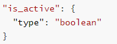

## 安装

​	Elasticsearch 的官方地址：https://www.elastic.co/cn/

### windows下目录介绍

| 目录    | 含义                                                |
| ------- | --------------------------------------------------- |
| bin     | 可执行脚本目录                                      |
| config  | 配置目录                                            |
| jdk     | 内置jdk目录(如果系统配置了JAVA_HOME，则使用系统JDK) |
| lib     | 类库                                                |
| logs    | 日志目录                                            |
| modules | 模块目录                                            |
| plugins | 插件目录                                            |

### 启动以及注意项

**启动：**bin目录下elasticsearch.bat文件为启动脚本。

注意：

​	9300 端口为 **Elasticsearch 集群间组件的通信** 端口。

​	9200 端口为 **用户使用访问的** http协议的RESTful 端口。

## ES存储格式

### 存储格式介绍

​	Elasticsearch 使用 **倒排索引**（inverted index）来存储和查找数据，但它的数据存储格式并不像传统的数据库那样直接存储行和列。

​	数据以 **JSON 格式** 存储在 Elasticsearch 中，且每个文档都包含一个或多个字段。这些字段通常会被索引以便高效查询。

**存储格式**：每个文档存储在一个内存结构中，通常以二进制的方式存储。实际存储内容通常包括：

- **原始数据**：即文档的 JSON 内容，通常存储在 `_source` 字段中。
- **倒排索引数据**：用于高效的查找和搜索。
- **字段数据**：根据字段类型，存储字段的索引或聚合数据（如 `keyword` 类型字段）。
- **其他元数据**：包括版本信息、文档 ID 等。

#### 与MYSQL对比

可以按照下图，将ES中的概念与关系型数据库做对比


具体来说：

1. **文档（Document）**：是 Elasticsearch 存储的基本单元，类似于数据库中的一行数据。每个文档都是一个 JSON 对象，包含多个字段。
2. **索引（Index）**：是存储文档的地方，可以理解为数据库中的一个数据库表。一个索引由多个 **分片（Shard）** 和 **副本（Replica）** 组成。
3. **字段（Field）**：是文档中的键值对，类似数据库表中的列。字段会根据配置是否进行索引（如 `text` 或 `keyword` 类型）来决定是否能够被全文搜索。
4. **倒排索引（Inverted Index）**：是 Elasticsearch 用来加速搜索的一种数据结构，允许快速查找含有特定词语的文档。倒排索引记录了词项和包含这些词项的文档 ID。
5. **类型（Type）**：相当于表，但是在7.X中这个概念已经被删除了。

### 倒排索引和正常数据库索引

​	倒排索引和传统数据库索引有本质的区别，主要体现在它们的结构和用途上。

#### 1. **倒排索引（Inverted Index）**：

倒排索引主要用于 **全文搜索**，其结构使得系统可以高效地找到包含特定词汇的文档。

- **结构**：倒排索引会将每个词（或称为“词项”）与包含该词的文档 ID 进行关联。
- **用途**：主要用于文本检索，如搜索引擎等需要查找包含某些关键词的文档的场景。

倒排索引的构建过程通常包括以下步骤：

1. **文档拆分**：将文档中的文本分解成词项（通常是单词或词组）。
2. **建立词项到文档的映射**：每个词项与包含它的文档 ID 建立映射关系，生成倒排索引。

#### 2. **传统数据库索引（B-tree、Hash Index）**：

传统的关系型数据库索引（如 MySQL 使用的 B-tree 索引）主要用于 **快速查找特定值**，例如查找某一列等于某个值的记录。

- **结构**：传统数据库索引一般使用 **B-tree** 或 **哈希表**。B-tree 索引用于对单个字段的值进行排序，并建立该字段与记录之间的快速访问路径。
- **用途**：主要用于加速数据查询，如精确查找某个字段的值，或者范围查询（如查找大于某个值的所有记录）。

#### 举个例子：

假设我们有以下两个文档（JSON 格式）：

- **文档 1**：`{ "id": 1, "content": "Elasticsearch is a distributed search engine" }`
- **文档 2**：`{ "id": 2, "content": "Elasticsearch provides real-time search capabilities" }`
- **文档 3**：`{ "id": 3, "content": "Search engines are used to search documents" }`

##### **倒排索引**

倒排索引的构建过程：

- 将每个文档中的单词拆解：
  - 文档 1：`Elasticsearch`, `is`, `a`, `distributed`, `search`, `engine`
  - 文档 2：`Elasticsearch`, `provides`, `real-time`, `search`, `capabilities`
  - 文档 3：`search`, `engines`, `are`, `used`, `to`, `documents`

倒排索引表大概会是这样的：

```rust
"Elasticsearch" -> [1, 2]  (文档 1 和 2 中都包含 "Elasticsearch")
"is" -> [1]
"a" -> [1]
"distributed" -> [1]
"search" -> [1, 2, 3]  (文档 1、2 和 3 中都包含 "search")
"engine" -> [1]
"provides" -> [2]
"real-time" -> [2]
"capabilities" -> [2]
"engines" -> [3]
"are" -> [3]
"used" -> [3]
"to" -> [3]
"documents" -> [3]
```

当你搜索词汇 `search` 时，倒排索引可以迅速告诉你它出现在哪些文档中：文档 1、2 和 3。这种索引结构在进行全文搜索时非常高效。

##### **传统数据库索引（B-tree）**

假设我们有一个简单的表格存储文档信息：

| id   | content                                              |
| ---- | ---------------------------------------------------- |
| 1    | Elasticsearch is a distributed search engine         |
| 2    | Elasticsearch provides real-time search capabilities |
| 3    | Search engines are used to search documents          |

如果我们在 `id` 列上建立了 B-tree 索引，那么索引会像这样组织：

```ini
id = 1 -> 文档 1
id = 2 -> 文档 2
id = 3 -> 文档 3
```

当你执行查询，如 `SELECT * FROM documents WHERE id = 2`，B-tree 索引会帮助数据库迅速找到 `id = 2` 这一行数据。

#### **区别总结**：

- **查询目的**：倒排索引用于全文搜索，可以快速查找某个词汇出现在哪些文档中；而传统数据库索引用于单个字段的值的查找，适用于精确查找、范围查询等。
- **结构**：倒排索引是将词项和文档 ID 关联起来，而传统数据库索引通常会对字段值进行排序或使用哈希映射来加速查询。
- **使用场景**：倒排索引适合用于文本搜索、关键词检索等场景，传统数据库索引适合用于范围查询、精确查找等场景。

## 基础操作

​	索引相当于数据库，创建索引就是创建一些数据库。

​	然后给对应的索引设置映射，映射就相当于是给索引设置一些规则(文档字段的存储方式、查询方式和分析方式)，就像是设置数据库的字符集、是否开启慢sql监控等。

​	之后给索引上传文档，也就是我们需要解析的文档，上传文档后，文档会根据索引设置的各种规则(分词规则、映射信息)生成倒排索引，便于查询。

​	也就是说，可以把 **Elasticsearch 索引** 看作是一个 **数据库**，每个索引有自己的 **映射（Mapping）**、**分词规则（Analyzer）**、**设置（Settings）** 等信息。而上传文档到指定索引时，就相当于按照该索引的规则来存储数据，生成倒排索引，并在查询时依赖于这些规则来执行搜索。

**创建索引或上传文档时指定的索引 和 上传文档后生成的倒排索引的区别：**

1. **上传文档到指定的索引**：

   - 这个“指定的索引”是你在上传文档时提供的索引名称，它决定了文档在哪个逻辑容器中存储。索引本质上是 Elasticsearch 存储文档和元数据（如倒排索引）的容器。

   例如，如果你上传文档到 `products` 索引，那么 Elasticsearch 会根据该索引的映射（Mapping）和设置（Settings）来存储文档，并在内部生成倒排索引。

2. **倒排索引**：

   - 对于每个被上传的文档，Elasticsearch 会对其内容（尤其是文本字段）进行解析，生成倒排索引。倒排索引的生成是基于文档中各个字段的内容（如文本分词后形成的词项）。这些倒排索引是存储在指定索引内的。

即：

- **上传文档指定索引**：指定文档应该属于哪个索引，这个索引为文档提供了映射规则、分析器等配置。
- **生成倒排索引**：文档上传后，文档字段会根据映射规则和分析器生成倒排索引，倒排索引是用来加速搜索的。

### HTTP 操作

​	注意，ES默认启动后，9200端口为对外服务接口。

#### 1、索引操作

##### **1)** **创建索引** 

​	对比关系型数据库，创建索引就等同于创建数据库。

​	也可以创建索引时就指定映射等规则，这里采用默认规则。

请求类型：PUT

请求地址：/{索引名称} 

响应体：

~~~ json
{
	"acknowledged": true, # 响应结果 true表示操作成功
	"shards_acknowledged": true, # 分片结果 true表示操作成功
	"index": "shopping" # 索引名称
}
~~~

例如：

​	在 Postman 中，向 ES 服务器发 **PUT** 请求 ：http://127.0.0.1:9200/shopping

响应体：

~~~ json
{
	"acknowledged": true,
	"shards_acknowledged": true,
	"index": "shopping"
}
~~~

​	再次创建索引shopping，就会创建失败，因为已经存在。

~~~ json
{
	"error": {
		"root_cause": [
			{
				"type": "resource_already_exists_exception",
				"reason": "index [shopping/WP8DXtUgQHqZOnmDkqxHsQ] already exists",
				"index_uuid": "WP8DXtUgQHqZOnmDkqxHsQ",
				"index": "shopping"
			}
		],
		"type": "resource_already_exists_exception",
		"reason": "index [shopping/WP8DXtUgQHqZOnmDkqxHsQ] already exists",
		"index_uuid": "WP8DXtUgQHqZOnmDkqxHsQ",
		"index": "shopping"
	},
	"status": 400
}
~~~

##### **2)** **查看所有索引**

请求类型：GET

请求地址：/_cat/indices?v 

响应体：

```json
health status index    uuid                   pri rep docs.count docs.deleted store.size pri.store.size
yellow open   shopping WP8DXtUgQHqZOnmDkqxHsQ   1   1          0            0       208b           208b
```

| 表头           | 含义                                                         |
| -------------- | ------------------------------------------------------------ |
| health         | 当前服务器健康状态： <br />  **green**(集群完整) <br />  **yellow**(单点正常、集群不完整) <br />  **red**(单点不正常) |
| status         | 索引打开、关闭状态                                           |
| index          | 索引名                                                       |
| uuid           | 索引统一编号                                                 |
| pri            | 主分片数量                                                   |
| rep            | 副本数量                                                     |
| docs.count     | 可用文档数量                                                 |
| docs.deleted   | 文档删除状态（逻辑删除）                                     |
| store.size     | 主分片和副分片整体占空间大小                                 |
| pri.store.size | 主分片占空间大小                                             |

例如：

​	在 Postman 中，向 ES 服务器发 **GET** 请求 ：http://127.0.0.1:9200/_cat/indices?v

响应体：


##### **3)** **查看单个索引**

请求类型：GET

请求地址：/{索引名称}

响应体：

```json
{
	"shopping": { # 索引名
		"aliases": {}, # 别名
		"mappings": {}, # 映射
		"settings": { # 配置
			"index": { # 配置-索引
				"creation_date": "1739341093610", # 创建时间
				"number_of_shards": "1", # 主分片数量
				"number_of_replicas": "1", # 副分片数量
				"uuid": "WP8DXtUgQHqZOnmDkqxHsQ", # 唯一标识
				"version": { # 版本
					"created": "7080099"
				},
				"provided_name": "shopping" # 名称
			}
		}
	}
}
```

##### **4)** **删除索引**

请求类型：DELETE

请求地址：/{索引名称}

响应体：

~~~ json
{
	"acknowledged": true # 删除成功
}
~~~

索引不存在，删除失败示例：

~~~ json
{
	"error": {
		"root_cause": [
			{
				"type": "index_not_found_exception",
				"reason": "no such index [test]",
				"resource.type": "index_or_alias",
				"resource.id": "test",
				"index_uuid": "_na_",
				"index": "test"
			}
		],
		"type": "index_not_found_exception",
		"reason": "no such index [test]",
		"resource.type": "index_or_alias",
		"resource.id": "test",
		"index_uuid": "_na_",
		"index": "test"
	},
	"status": 404
}
~~~

#### 2、文档操作

##### **1)** **创建文档** 

​	索引已经创建好了，接下来我们来创建文档，并添加数据。

​	这里的文档可以类比为关系型数据库中的表数据，添加的数据格式为 JSON 格式 。

请求类型：POST

请求地址：

​	由ES生成文档id：/{索引名称}/_doc 	

​		即： 索引名称 + _doc

​	自定义文档id：/{索引名称}/_doc/{id} 	

​		即：索引名称 + _doc + 自定义id。若id已存在，则更新对应文档。

请求体：

​	请求体必须为JSON格式的内容。

响应体：

~~~ json
{
	"_index": "shopping", # 索引名称
	"_type": "_doc", # 类型，doc:文档类型
	"_id": "L4qP-ZQBREgr-UZp08bI", # 类似于主键
	"_version": 1, # 版本
	"result": "created", # 结果，created表示创建成功
	"_shards": { # 分片
		"total": 2, # 分片总数
		"successful": 1,  # 分片成功数
		"failed": 0 # 分片失败数
	},
	"_seq_no": 0,
	"_primary_term": 1
}
~~~

例如：

​	在 Postman 中，向 ES 服务器发 **POST** 请求 ：http://127.0.0.1:9200/shopping/_doc

请求体

```json
{
 "title":"测试",
 "category":"123",
 "test":"test"
}
```

响应体

~~~ json
{
	"_index": "shopping", # 索引名称
	"_type": "_doc", # 类型，doc:文档类型
	"_id": "L4qP-ZQBREgr-UZp08bI", # 类似于主键
	"_version": 1, # 版本
	"result": "created", # 结果，created表示创建成功
	"_shards": { # 分片
		"total": 2, # 分片总数
		"successful": 1,  # 分片成功数
		"failed": 0 # 分片失败数
	},
	"_seq_no": 0,
	"_primary_term": 1
}
~~~

##### **2)** **查看文档** 

​	查看文档时，需要指明文档的唯一性标识，类似于 MySQL 中数据的主键查询

请求类型：GET

请求地址：

​	/{索引名称}/_doc/{id} 	

​	即：索引名称 + _doc + 文档id。

响应体：

~~~ json
{
	"_index": "shopping", # 索引名称
	"_type": "_doc", # 类型，doc标识文档类型
	"_id": "01", # 唯一标识
	"_version": 1, # 版本
	"_seq_no": 1, # 用于并发控制和版本管理，通常在执行并发更新时使用。
	"_primary_term": 1, # 用于并发控制和版本管理，通常在执行并发更新时使用。
	"found": true,# 查询结果，true标识查询到了
	"_source": { # 文档源信息
		"title": "测试",
		"category": "123",
		"test": "test"
	}
}
~~~

##### **3)** **修改文档** 

​	和新增文档一样，输入相同的 URL 地址请求，如果请求体变化，会将原有的数据内容覆盖 

请求类型：POST

请求地址：

​	/{索引名称}/_doc/{id} 	

​	即：索引名称 + _doc + 自定义id。

请求体：

​	必须为json格式，例如：

~~~ json
{
    "title": "测试",
    "category": "123",
    "test": "test",
    "desc":"添加属性测试"
}
~~~

响应体

~~~ json
{
	"_index": "shopping",
	"_type": "_doc",
	"_id": "01",
	"_version": 2, # 更新后版本号+1
	"result": "updated",# 处理结果，update标识数据被更新
	"_shards": {
		"total": 2,
		"successful": 1,
		"failed": 0
	},
	"_seq_no": 2,
	"_primary_term": 1
}
~~~

##### **4)** **修改文档字段** 

​	修改数据时，也可以只修改某一给条数据的局部信息

请求类型：POST

请求地址：

​	/{索引名称}/_update/{id} 	

​	即：索引名称 + _update + 自定义id。

请求体：

​	必须为json格式，针对上述修改文档中的属性进行修改

​	注意点1：必须使用 `doc` 包装你要更新的字段`doc` 是用来指定更新文档的部分内容的，它告诉 Elasticsearch **只更新文档的一部分字段**，而不是整个文档。

​	注意点2：如果文档中不存在某个字段，`_update` 操作会 **创建该字段**。

~~~ json
{
    "title": "测试",
    "category": "123",
    "test": "test",
    "desc":"添加属性测试"
}
-----修改其中的desc属性-------
{
    "doc": {
        "desc": "修改字段测试"
    }
}
~~~

响应体

~~~ json
{
	"_index": "shopping",
	"_type": "_doc",
	"_id": "01",
	"_version": 3,
	"result": "updated",
	"_shards": {
		"total": 2,
		"successful": 1,
		"failed": 0
	},
	"_seq_no": 3,
	"_primary_term": 1
}
~~~

##### **5)** **删除文档** 

​	删除一个文档不会立即从磁盘上移除，它只是被标记成已删除（逻辑删除）。

​	之后查询将查询不到。

请求类型：DELETE

请求地址：

​	/{索引名称}/_doc/{id} 	

​	即： 索引名称 + _doc + 自定义id。

响应体：

~~~ json
{
	"_index": "shopping",
	"_type": "_doc",
	"_id": "01",
	"_version": 5, # 版本更新
	"result": "deleted", # 结果deleted表示被标记为逻辑删除
	"_shards": {
		"total": 2,
		"successful": 1,
		"failed": 0
	},
	"_seq_no": 5,
	"_primary_term": 1
}
~~~

##### **6)** **条件删除文档** 

​	一般删除数据都是根据文档的唯一性标识进行删除，实际操作时，也可以根据条件对多条数据进行删除 。

首先分别增加多条数据:

~~~ json
{
 "title":"测试",
 "category":"123",
 "test":"test"
}
---------------------------
{
 "title":"测试2",
 "category":"123",
 "test":"test"
}
~~~

请求类型：POST

请求地址：

​	/{索引名称}/_delete_by_query

​	即：索引名称 + _doc + _delete_by_query。

请求体内容：

​	json格式

~~~ json
{
    "query": {
        "match": {
            "title": "测试2"
        }
    }
}
~~~

响应体：

~~~ json
{
	"took": 256,# 耗时
	"timed_out": false,# 是否超时
	"total": 3,# 总数
	"deleted": 3,# 删除数量
	"batches": 1,
	"version_conflicts": 0,
	"noops": 0,
	"retries": {
		"bulk": 0,
		"search": 0
	},
	"throttled_millis": 0,
	"requests_per_second": -1,
	"throttled_until_millis": 0,
	"failures": []
}
~~~

#### 3、映射操作

​	有了索引库，等于有了数据库中的 database。

​	接下来就需要建索引库(index)中的映射了，类似于数据库(database)中的表结构(table)。 

​	创建数据库表需要设置字段名称，类型，长度，约束等；

​	索引库也一样，需要知道这个类型下有哪些字段，每个字段有哪些约束信息，这就叫做映射(mapping)。

##### **1)** 创建映射

​	对比关系型数据库，创建索引就等同于创建数据库。

请求类型：PUT

请求地址：/{索引名称}/_mapping 

​	即 索引名称 + _mapping

请求体：

~~~ json
{
  "settings": {
    "number_of_shards": 3,  // 分片数量
    "number_of_replicas": 2  // 副本数量
  },
  "mappings": {
    "properties": {
      "name": {
        "type": "text",  // 文本字段，会进行分词
        "analyzer": "standard"  // 使用标准分词器
      },
      "price": {
        "type": "float",  // 数值字段，表示浮动数值
        "index": true  // 该字段会被索引
      },
      "created_at": {
        "type": "date",  // 日期字段
        "format": "yyyy-MM-dd HH:mm:ss"  // 日期格式
      },
      "category": {
        "type": "keyword",  // 精确匹配字段，不会分词
        "index": true  // 该字段会被索引
      }
    }
  }
}
~~~

其中，各个参数具体介绍：

**settings**：设置索引的一些基本属性，比如分片数、复制数等。

- `number_of_shards`: 定义索引的分片数量。
- `number_of_replicas`: 定义索引的副本数量。

**mappings**：定义索引中字段的属性。

- **properties**：定义具体字段的属性，如字段的类型、分析器等。

- 每个字段可以有不同的类型和设置。例如，`text` 字段适用于需要分词的文本数据，而 `keyword` 字段适用于不进行分词的精确匹配。

  | 类型                     | 作用                                                       | 示例                                                |
  | ------------------------ | ---------------------------------------------------------- | --------------------------------------------------- |
  | **text**                 | 用于存储文本数据，会被分词。适用于全文搜索。               |  |
  | **keyword**              | 用于存储不进行分词的精确值，适用于过滤、排序、聚合等操作。 |  |
  | **date**                 | 用于存储日期类型数据，可以指定日期格式。                   |  |
  | **integer、float、long** | 用于存储数字数据。选择合适的类型来保证存储效率。           |  |
  | **boolean**              | 用于存储布尔类型的数据。                                   |  |
  | **object**               | 用于存储 JSON 对象，可以包含多个字段。                     |  |
  | **nested**               | 用于存储嵌套对象，以便执行嵌套查询。                       |  |

例如：


